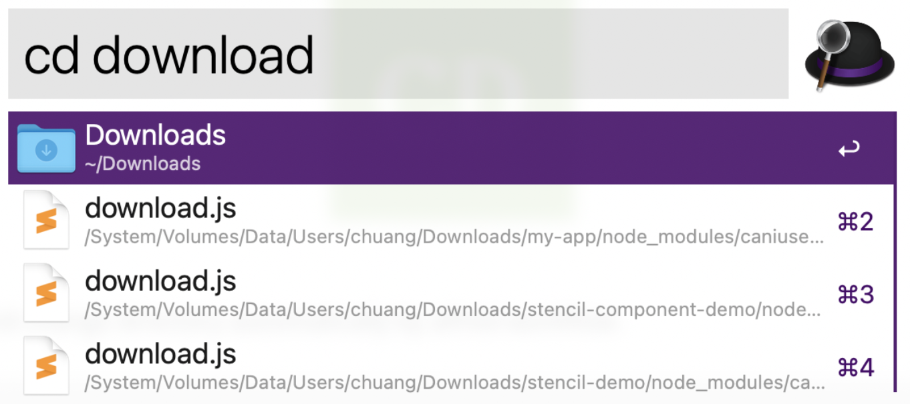
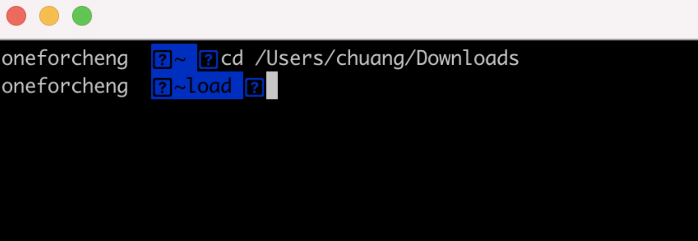
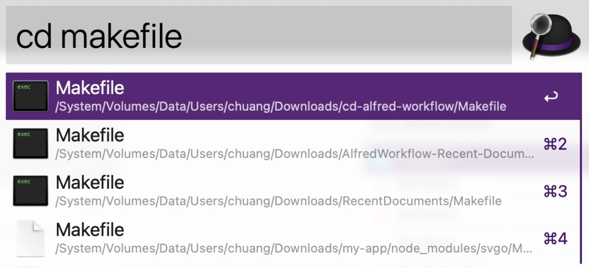
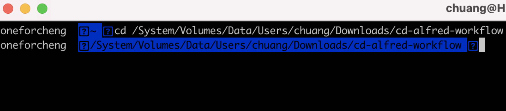

# CD alfred workflow

    

 

open iTerm or Terminal and change directory automatically by alfred workflow.

 

### Examples

##### (1) cd directory in iTerm

input name of directory to query:

 

##### (2) cd directory of file in iTerm

input name of file to query:

 

### Note

if you don't install iTerm, `cd` will open Terminal instead of iTerm.
